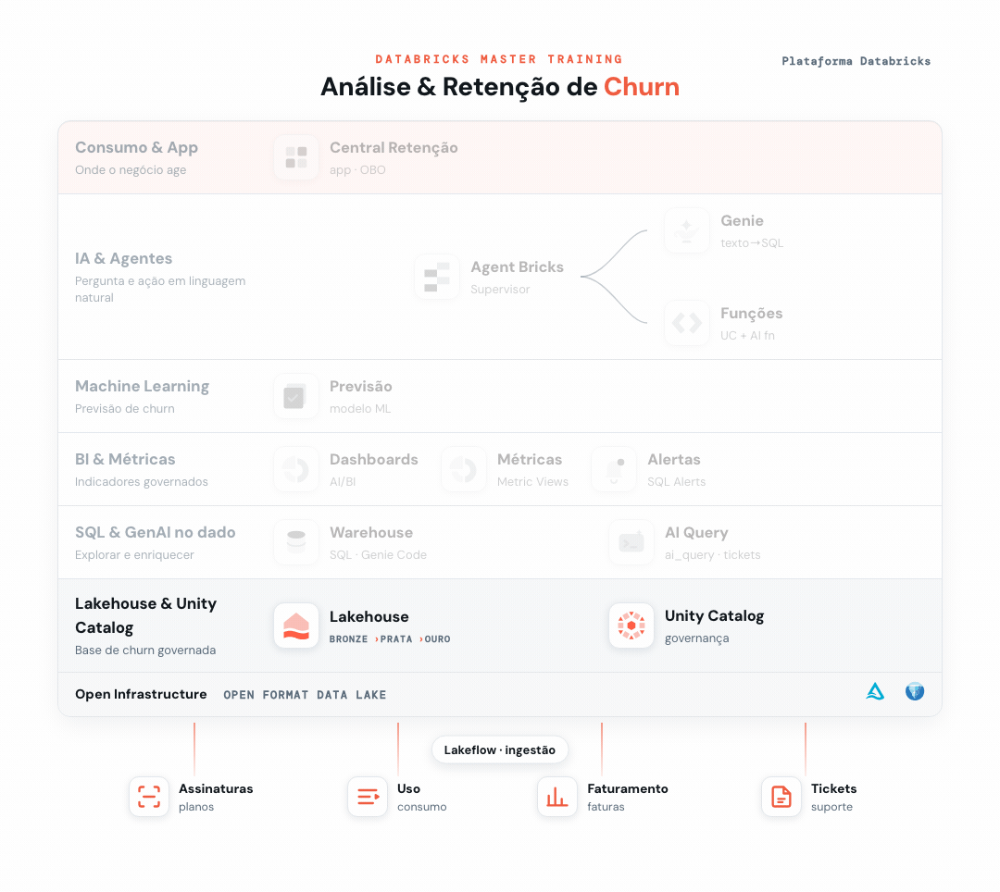

# 00 - Setup: Base compartilhada + Habilitação da turma



> _Em destaque, o que você já construiu na trilha até este ponto; em cinza, o que ainda vem._

Um único notebook, rodado uma vez pelo **administrador de conta**, que faz tudo: prepara a turma (grupo, permissões, compute), carrega a base compartilhada de churn e verifica que cada participante (e o workspace) está pronto. É **idempotente** (seguro re-executar).

## Conteúdo

| Pasta | O quê |
|-------|-------|
| `data/` | CSVs de origem (dataset fixo, 1 por tabela) |
| `setup/` | Notebook `00_setup_base_churn.py`: prepara a turma, carrega os dados e verifica tudo |

## O que o Setup faz

**Prepara a turma** (idempotente):
- Grupo de conta `dbacademy_workshop` (participantes + `workspace-access` + `databricks-sql-access`)
- Catálogo `dbacademy` (trata metastore sem *Default Storage*)
- SQL Warehouse `dbacademy_workshop_wh` e cluster multiuso `dbacademy_workshop_cluster`
- Concessões ao grupo: `USE CATALOG` + `CREATE SCHEMA` (schema pessoal), warehouse `CAN_USE`, cluster `CAN_ATTACH_TO`

**Carrega a base compartilhada** (no schema `<catálogo>.churn`, somente leitura para a turma):
- Dimensões `dim_cliente`, `dim_plano`, `dim_data` e fatos `fato_assinatura`, `fato_uso`, `fato_faturamento`, `fato_ticket_suporte`
- `feature_churn`: tabela analítica por cliente (para o modelo de churn)
- Comentários + chaves (PK/FK) em todas as tabelas
- Volume `kb_volume` com a base de conhecimento (FAQ, Política de Retenção, Playbook de CS)
- Concede à turma `USE SCHEMA` + `SELECT` no schema `churn` e `READ VOLUME` no `kb_volume`

**Verifica**: matriz de permissões por participante + as features de IA usadas nos Ex. 4/6/7 (Model Serving/Foundation Model APIs e Multi-Agent Supervisor). Veredito na seção **7. Relatório final**.

## Passos

1. **Pré-requisito:** rodar como administrador de conta. Se o catálogo `dbacademy` não puder ser criado automaticamente (contas com *Default Storage*), crie-o antes pela UI: **Catalog Explorer → Create catalog → Default Storage**.
2. Importe o notebook por URL: **Workspace → Import → URL** com
```
https://github.com/CaduBettanim/Databricks-Master-Training/blob/main/00%20-%20Setup/setup/00_setup_base_churn.py
```
3. Rode as duas primeiras células para exibir os widgets, selecione os participantes e ajuste os alternadores (criar catálogo/warehouse/cluster). (Opcional: ajuste `NOME_CATALOGO`/`NOME_SCHEMA` na célula de parâmetros.)
4. Anexe **Serverless** (ou um cluster) e clique em **Run all**. Todas as células devem terminar com sucesso (`✅ CHECKS COMPLETOS`).

## Resultado esperado (dataset fixo → valores exatos)

| Métrica | Valor |
|---------|-------|
| clientes | **2.000** |
| tickets | **1.253** |
| taxa de churn | **0,270** |
| corr. uso × churn | **-0,504** |
| corr. atraso × churn | **0,125** |

Se os números baterem exatamente, a carga está íntegra. A correlação negativa forte (uso ↓ → churn ↑) confirma o sinal necessário para o modelo dos próximos módulos.
