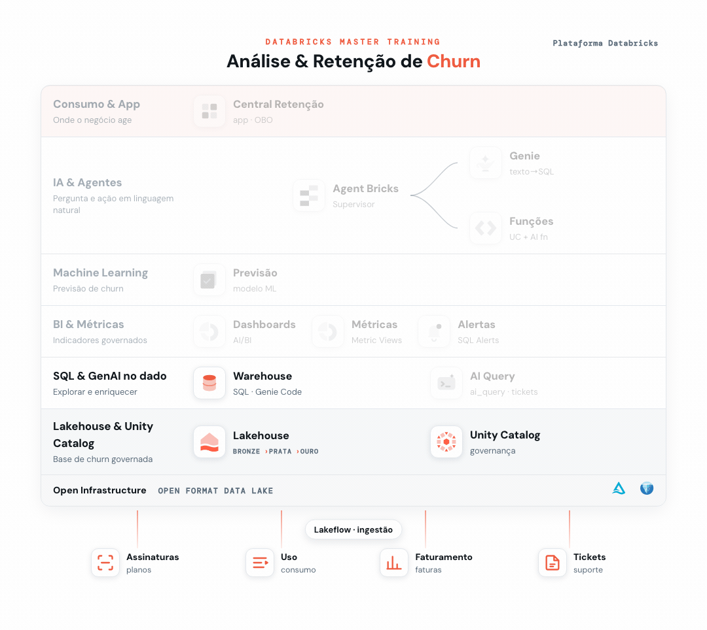

# 01 - SQL com IA



> _Em destaque, o que você já construiu na trilha até este ponto; em cinza, o que ainda vem._

Seu primeiro contato com os dados de churn: você vai explorar no **SQL Editor** e usar o **Genie Code** (assistente de IA ✨) para gerar consultas em linguagem natural.

**Pré-requisito:** [Setup](../00%20-%20Setup) concluído. A base `dbacademy.churn` deve existir.

## Objetivo
- Navegar no SQL Editor e consultar a base compartilhada `dbacademy.churn`.
- Deixar o Genie Code escrever SQL a partir de perguntas em português.
- Conhecer recursos Delta (histórico, time travel).

> As consultas prontas estão em [`consultas.sql`](./consultas.sql). Ajuste o catálogo se você não usou `dbacademy`.

---

## Passo 0: Crie o seu database pessoal
Você lê a base compartilhada `dbacademy.churn`, mas o que você criar (a partir do Ex. 3) vai no seu schema. Convenção: 1ª letra do nome + sobrenome (ex.: *João Silva* → `jsilva`).
```sql
CREATE SCHEMA IF NOT EXISTS dbacademy.<seu_db>;
```

## Passo 1: Abrir o SQL Editor
No menu lateral, **SQL Editor**. No seletor de contexto, escolha o catálogo `dbacademy` e o schema `churn`.

## Passo 2: Consultas guiadas
Rode uma a uma e observe os resultados:

**2.1 Clientes por segmento**
```sql
SELECT segmento, COUNT(*) AS clientes
FROM dbacademy.churn.dim_cliente
GROUP BY segmento
ORDER BY clientes DESC;
```

**2.2 Assinaturas ativas x canceladas**
```sql
SELECT status, COUNT(*) AS qtd
FROM dbacademy.churn.fato_assinatura
GROUP BY status
ORDER BY qtd DESC;
```

**2.3 Top motivos de cancelamento**
```sql
SELECT motivo_cancelamento, COUNT(*) AS qtd
FROM dbacademy.churn.fato_assinatura
WHERE churn_flag = 1
GROUP BY motivo_cancelamento
ORDER BY qtd DESC;
```

**2.4 Taxa de churn por segmento**
```sql
SELECT c.segmento, ROUND(AVG(a.churn_flag), 3) AS taxa_churn
FROM dbacademy.churn.fato_assinatura a
JOIN dbacademy.churn.dim_cliente c ON a.id_cliente = c.id_cliente
GROUP BY c.segmento
ORDER BY taxa_churn DESC;
```

> Todas as consultas também estão em [`consultas.sql`](./consultas.sql).

## Passo 3: Genie Code para gerar SQL em linguagem natural

O Genie Code é o assistente do SQL Editor que escreve o código SQL para você. É diferente da **Genie** (espaço conversacional, Ex. 7), que *responde perguntas*. Aqui o foco é montar a consulta.

> **Regra de ouro (para todos gerarem o mesmo resultado):** **nomeie sempre a tabela**. Não precisa listar as colunas: os comentários que documentamos no Setup fazem a IA acertar. Só acrescente um detalhe quando houver ambiguidade real: qual data (há mais de uma), o limiar de um termo vago, ou a definição de uma métrica aberta.

Abra o assistente (✨) no SQL Editor e cole um prompt de cada vez (use o botão de copiar no canto de cada bloco), revise o SQL gerado e execute:

**1. Taxa de churn por segmento**
```text
Escreva o SQL da taxa de churn por segmento usando a tabela dbacademy.churn.feature_churn.
```

<details>
<summary>👉 Resultado:</summary>

```sql
SELECT segmento, ROUND(AVG(churn_flag), 3) AS taxa_churn
FROM dbacademy.churn.feature_churn
GROUP BY segmento
ORDER BY taxa_churn DESC;
```

</details>

**2. Top 5 motivos de cancelamento**
```text
Escreva uma query com os 5 principais motivos de cancelamento das assinaturas canceladas (churn_flag = 1) usando a dbacademy.churn.fato_assinatura.
```

<details>
<summary>👉 Resultado:</summary>

```sql
SELECT motivo_cancelamento, COUNT(*) AS qtd
FROM dbacademy.churn.fato_assinatura
WHERE churn_flag = 1
GROUP BY motivo_cancelamento
ORDER BY qtd DESC
LIMIT 5;
```

</details>

**3. Taxa de churn por plano**
```text
Escreva a taxa de churn por plano usando dbacademy.churn.fato_assinatura e dbacademy.churn.dim_plano.
```

<details>
<summary>👉 Resultado:</summary>

```sql
SELECT p.nome_plano, ROUND(AVG(a.churn_flag), 3) AS taxa_churn
FROM dbacademy.churn.fato_assinatura a
JOIN dbacademy.churn.dim_plano p ON a.id_plano = p.id_plano
GROUP BY p.nome_plano
ORDER BY taxa_churn DESC;
```

</details>

**4. Cancelamentos por mês**
```text
Conte quantas assinaturas foram canceladas por mês usando dbacademy.churn.fato_assinatura, considerando apenas as canceladas (churn_flag = 1) pela data de cancelamento (data_fim).
```

<details>
<summary>👉 Resultado:</summary>

```sql
SELECT date_trunc('month', data_fim) AS mes, COUNT(*) AS cancelamentos
FROM dbacademy.churn.fato_assinatura
WHERE churn_flag = 1
GROUP BY 1
ORDER BY 1;
```

</details>

## 🎯 Desafio
Qual plano tem a maior taxa de churn e quantos clientes perdeu?

---

## Resultados esperados (dataset fixo → valores exatos)

**Clientes por segmento:** Consumidor **1.200** · PME **595** · Corporativo **205**
**Assinaturas:** Ativa **1.460** · Cancelada **540**
**Top motivos:** Insatisfação **196** · Preço **148** · Concorrência **104** · Atendimento **80** · Mudança de necessidade **12**
**Taxa de churn por segmento:** Consumidor **0,303** · PME **0,239** · Corporativo **0,166**

**🎯 Desafio (churn por plano):**
| Plano | Taxa de churn | Clientes perdidos |
|-------|:---:|:---:|
| **Básico** | **0,317** | **257** |
| Padrão | 0,274 | 160 |
| Premium | 0,225 | 92 |
| Empresarial | 0,157 | 31 |

➡️ O plano **Básico** concentra o maior churn, coerente com o negócio (menor barreira de saída, menor valor percebido).
