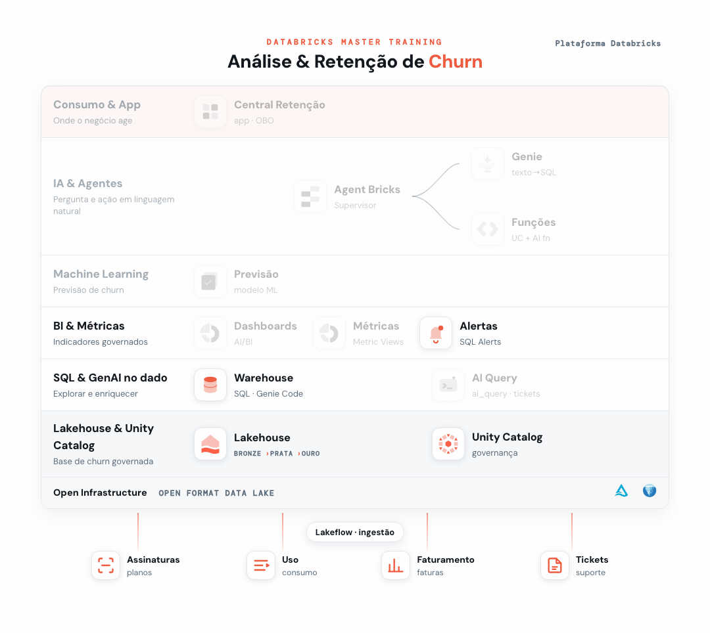

# 02 - Geração de Alertas



> _Em destaque, o que você já construiu na trilha até este ponto; em cinza, o que ainda vem._

Aqui você configura um alerta que avisa sozinho quando um indicador de churn cruza um limite, sem precisar abrir relatórios todo dia.

**Pré-requisito:** [Setup](../00%20-%20Setup) concluído (base `dbacademy.churn`).

## Objetivo
Criar um **Alerta** no Databricks SQL: uma consulta que roda em uma agenda e notifica quando uma condição é atendida.

---

## Passo 1: A consulta base
O alerta observa o resultado de uma consulta. Vamos monitorar a taxa de churn global (%):
```sql
SELECT ROUND(AVG(churn_flag) * 100, 1) AS taxa_churn_pct
FROM dbacademy.churn.fato_assinatura;
```

## Passo 2: Criar o alerta
1. No menu lateral, abra **Alerts** → **Create alert**.
2. Em **Query**, cole a consulta acima e clique em **Run** (deve retornar `taxa_churn_pct = 27.0`).
3. Configure a **condição de disparo**:
   - Coluna: `taxa_churn_pct`
   - Operador: **maior que (>)**
   - Valor (threshold): **25**
4. **Nome:** `Alerta_Churn_<seu_nome>`.
5. Em **Notifications**, informe o e-mail para receber o alerta.
6. Defina a agenda (ex.: diária) e clique em **Run Alert**.

Como a taxa atual é **27,0** e o limite é **25**, o alerta entra em estado disparado (triggered).

## Passo 3 (variação): Alerta de NPS baixo
Edite o processo com esta consulta e a condição `nps_medio < 7`:
```sql
SELECT ROUND(AVG(nps), 2) AS nps_medio
FROM dbacademy.churn.fato_ticket_suporte;
```
Valor atual: **6,53** → também dispara.

> **Nota:** aqui os dados são um dataset fixo, então o valor não muda, o que é ótimo para ver o alerta disparar de forma previsível. Em produção, a mesma configuração vira monitoramento contínuo: a agenda reavalia a consulta e avisa quando o indicador cruza o limite.

---

## Resultado esperado
| Alerta | Consulta retorna | Condição | Estado |
|--------|:---:|:---:|:---:|
| Taxa de churn | **27,0** | > 25 | 🔴 Disparado |
| NPS médio | **6,53** | < 7 | 🔴 Disparado |
