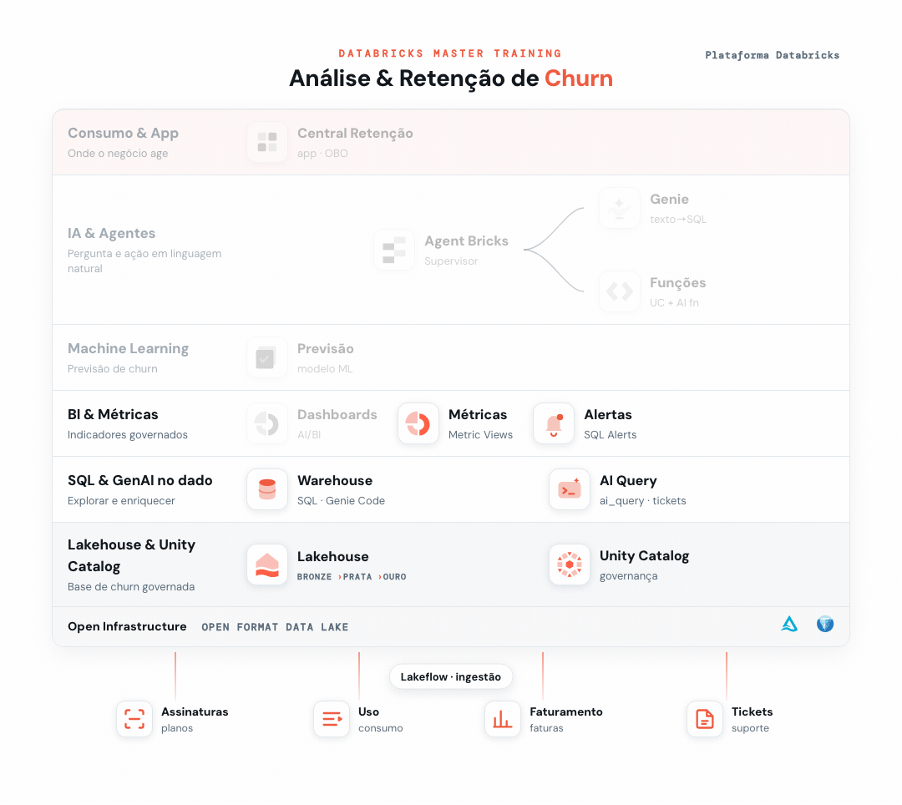

# 04 - IA Generativa no SQL



> _Em destaque, o que você já construiu na trilha até este ponto; em cinza, o que ainda vem._

Aplicar **IA Generativa direto no SQL** sobre o texto dos tickets de suporte — a "voz do cliente" — sem treinar modelo e sem sair do SQL Editor.

**Pré-requisito:** [Setup](../00%20-%20Setup) concluído (base `dbacademy.churn`).

## Objetivo
Usar as **AI Functions** do Databricks para analisar o campo `texto_reclamacao` da `fato_ticket_suporte`:
- **`ai_analyze_sentiment`** — sentimento (positive / neutral / negative)
- **`ai_classify`** — classificar o assunto do ticket
- **`ai_mask`** — mascarar dados pessoais (PII)
- **`ai_summarize`** — resumir as principais dores

> As funções chamam um modelo de IA — podem levar **alguns segundos por linha**. Use os `LIMIT` dos exemplos. Todas as consultas estão em [`ai_functions.sql`](./ai_functions.sql).

---

## 1a. Sentimento — `ai_analyze_sentiment`
```sql
WITH amostra AS (
  (SELECT texto_reclamacao, csat FROM dbacademy.churn.fato_ticket_suporte WHERE csat = 5 LIMIT 2)
  UNION ALL (SELECT texto_reclamacao, csat FROM dbacademy.churn.fato_ticket_suporte WHERE csat = 3 LIMIT 2)
  UNION ALL (SELECT texto_reclamacao, csat FROM dbacademy.churn.fato_ticket_suporte WHERE csat = 1 LIMIT 2)
)
SELECT LEFT(texto_reclamacao, 60) AS trecho, csat,
       ai_analyze_sentiment(texto_reclamacao) AS sentimento
FROM amostra ORDER BY csat DESC;
```
Resultado: `csat 5 → positive` · `csat 3 → neutral` · `csat 1 → negative` — o sentimento acompanha a nota.

> **Dica:** usamos uma **amostra variada** (csat 5, 3 e 1) de propósito, para ver a IA distinguindo os casos. Se você ordenar só pelos piores tickets, tudo volta negativo.

## 1b. Distribuição de sentimento com Genie Code (últimos 100)
Agora, em vez de escrever o SQL, **peça ao Genie Code**. Cole este prompt no assistente (✨), revise o SQL gerado e execute:
```text
Usando a tabela dbacademy.churn.fato_ticket_suporte, escreva uma consulta que aplique ai_analyze_sentiment na coluna texto_reclamacao dos últimos 100 tickets (por data_abertura) e conte quantos são positivos, neutros e negativos.
```

<details>
<summary>👉 Resultado:</summary>

```sql
SELECT sentimento, COUNT(*) AS qtd
FROM (
  SELECT ai_analyze_sentiment(texto_reclamacao) AS sentimento
  FROM dbacademy.churn.fato_ticket_suporte
  ORDER BY data_abertura DESC
  LIMIT 100
)
GROUP BY sentimento
ORDER BY qtd DESC;
```

</details>

Resultado esperado (últimos 100): **aproximadamente 32 positive · 36 neutral · 32 negative** (como é IA, pode variar 1–2).
> Roda em segundos por ser uma amostra. Repare: o texto livre virou um **indicador contável** — e você gerou a consulta só descrevendo o que queria.

## 1c. Sentimento com um modelo específico — `ai_query`
As funções acima usam o modelo **padrão** do Databricks. Com **`ai_query`** você escolhe **qual modelo** usar. Selecione uma destas 3 opções e altere o 1º argumento da query com seu modelo favorito:
- `databricks-meta-llama-3-3-70b-instruct` (Llama)
- `databricks-gpt-oss-120b` (OpenAI)
- `databricks-claude-haiku-4-5` (Claude)
```sql
WITH amostra AS (
  (SELECT texto_reclamacao, csat FROM dbacademy.churn.fato_ticket_suporte WHERE csat = 5 LIMIT 2)
  UNION ALL (SELECT texto_reclamacao, csat FROM dbacademy.churn.fato_ticket_suporte WHERE csat = 3 LIMIT 2)
  UNION ALL (SELECT texto_reclamacao, csat FROM dbacademy.churn.fato_ticket_suporte WHERE csat = 1 LIMIT 2)
)
SELECT csat, LEFT(texto_reclamacao, 60) AS trecho,
       ai_query('databricks-meta-llama-3-3-70b-instruct',
                'Classifique o sentimento como positive, neutral ou negative. Responda apenas com a palavra. Comentário: ' || texto_reclamacao) AS sentimento
FROM amostra ORDER BY csat DESC;
```
Resultado (Llama): `csat 5 → Positive` · `csat 3 → Neutral` · `csat 1 → Negative`.

## 2. Classificação — `ai_classify`
```sql
WITH amostra AS (
  (SELECT texto_reclamacao, csat FROM dbacademy.churn.fato_ticket_suporte WHERE csat = 5 LIMIT 2)
  UNION ALL (SELECT texto_reclamacao, csat FROM dbacademy.churn.fato_ticket_suporte WHERE csat = 3 LIMIT 2)
  UNION ALL (SELECT texto_reclamacao, csat FROM dbacademy.churn.fato_ticket_suporte WHERE csat = 1 LIMIT 2)
)
SELECT LEFT(texto_reclamacao, 60) AS trecho, csat,
       ai_classify(texto_reclamacao,
                   ARRAY('Cobrança','Técnico','Cancelamento','Elogio','Dúvida')) AS categoria_ia
FROM amostra ORDER BY csat DESC;
```
A IA lê o texto livre e escolhe uma das categorias que você definiu (ex.: elogio → **`Elogio`**, "já pedi cancelamento…" → **`Cancelamento`**).

## 2b. Classificação com um modelo específico — `ai_query`
Mesma ideia da 1c, agora classificando o assunto. Selecione um modelo (Llama, GPT-OSS ou Claude) e altere o 1º argumento:
```sql
WITH amostra AS (
  (SELECT texto_reclamacao, csat FROM dbacademy.churn.fato_ticket_suporte WHERE csat = 5 LIMIT 2)
  UNION ALL (SELECT texto_reclamacao, csat FROM dbacademy.churn.fato_ticket_suporte WHERE csat = 3 LIMIT 2)
  UNION ALL (SELECT texto_reclamacao, csat FROM dbacademy.churn.fato_ticket_suporte WHERE csat = 1 LIMIT 2)
)
SELECT csat, LEFT(texto_reclamacao, 60) AS trecho,
       ai_query('databricks-gpt-oss-120b',
                'Classifique o assunto em uma destas categorias: Cobrança, Técnico, Cancelamento, Elogio, Dúvida. Responda apenas com a categoria. Comentário: ' || texto_reclamacao) AS categoria
FROM amostra ORDER BY csat DESC;
```
Resultado (GPT-OSS): `csat 5 → Elogio` · `csat 3 → Dúvida` · `csat 1 → Cancelamento`.

## 3. Mascaramento de PII — `ai_mask`
```sql
SELECT ai_mask(texto_reclamacao, ARRAY('person','phone','email')) AS texto_anonimizado
FROM dbacademy.churn.fato_ticket_suporte
WHERE texto_reclamacao LIKE '%@%' OR texto_reclamacao LIKE '%-____%'
LIMIT 5;
```
Ex.: *"Meu email é c00015@exemplo.com.br e ainda não recebi retorno."* →
*"Meu email é **[MASKED]** e ainda não recebi retorno."*
Ótimo para compartilhar dados de suporte sem expor informações pessoais — um gancho com a governança do Unity Catalog.

## 4. Resumo dos comentários com Genie Code — `ai_summarize`
Novamente, **peça ao Genie Code**. Cole este prompt no assistente (✨), revise o SQL gerado e execute:
```text
Usando a tabela dbacademy.churn.fato_ticket_suporte, gere uma consulta que pegue os últimos 100 comentários e use ai_summarize para resumir o que os clientes estão dizendo.
```

<details>
<summary>👉 Resultado:</summary>

```sql
SELECT ai_summarize(array_join(collect_list(texto_reclamacao), ' | '), 150) AS resumo
FROM (
  SELECT texto_reclamacao
  FROM dbacademy.churn.fato_ticket_suporte
  ORDER BY data_abertura DESC
  LIMIT 100
);
```

</details>

Retorna algo como:
> *"Os últimos 100 tickets revelam que os clientes relatam principalmente problemas com atendimento, cobranças indevidas e instabilidade do serviço, mas também há registros de elogios ao suporte e atendimento de qualidade."*

Em vez de ler 100 tickets, você tem o **panorama em um parágrafo** — e gerou a consulta só descrevendo o que queria.

---

## 🎯 Desafio
Você está recebendo muitos comentários negativos e isso está impactando a relação com seus clientes. **Mostre como você pode selecionar 50 comentários negativos e gerar respostas para eles!**

**Dica:** Genie Code + AI Functions 😉

## Explore
As AI Functions transformam texto livre em dados estruturados — sentimento e categoria viram colunas que você pode agregar, filtrar e cruzar com churn. Esse "sinal" da voz do cliente será usado adiante no modelo (Ex. 6) e nos agentes.
