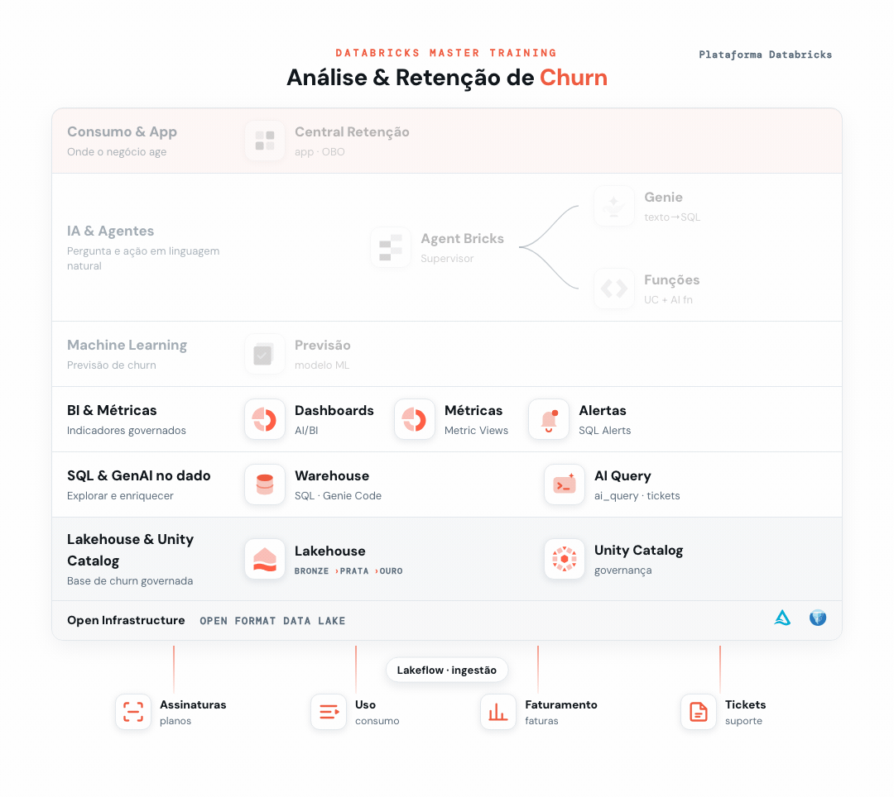

# 05 - Dashboards com IA



> _Em destaque, o que você já construiu na trilha até este ponto; em cinza, o que ainda vem._

Vamos transformar os dados de churn em um **painel executivo**: você deixa o **Genie** montar os gráficos a partir de prompts e reaproveita a metric view que criou no Ex. 3. Você descreve as análises, ele monta; você só ajusta e publica.

**Pré-requisitos:**
- [Setup](../00%20-%20Setup) concluído (base `dbacademy.churn`).
- [Ex. 3 - Métricas de Negócio](../03%20-%20M%C3%A9tricas%20de%20Neg%C3%B3cio) concluído: a sua metric view `mvw_churn` precisa existir no seu database pessoal (`dbacademy.<seu_db>`).

## Objetivo
Construir um dashboard **AI/BI** de retenção com:
- um KPI de taxa de churn;
- churn por plano e por segmento;
- cancelamentos ao longo do tempo;
- um mapa de churn por região;
- 2 filtros (plano, segmento) que deixam o painel interativo;
- o logo do treinamento no topo.

> As 4 primeiras análises saem direto da sua `mvw_churn`: a mesma medida governada que você definiu no Ex. 3, agora virando gráfico.

---

## Passo 1: Criar o dashboard
No menu lateral, **New → Dashboard** e clique em **Create Dashboard**.

## Passo 2: Gerar as análises com o Genie (sobre a sua metric view)
Logo após criar, escolha a opção **"Create a Dashboard with Genie"** e cole este prompt (troque `<seu_db>` pelo seu database pessoal):

```text
Utilizando a metric view mvw_churn do dbacademy.<seu_db>, crie análises de churn: um indicador (KPI) com a Taxa de Churn geral; um gráfico de barras com a Taxa de Churn por Plano, da maior para a menor; um gráfico de barras com a Taxa de Churn por Segmento; e um gráfico de linha com os Cancelamentos por Mês.
```

Resultados esperados (confira se batem):
- **KPI Taxa de Churn:** ≈ **27%** (540 cancelamentos em 2.000 clientes).
- **Por plano:** Básico **31,7%** · Padrão **27,4%** · Premium **22,5%** · Empresarial **15,7%**. Quanto mais barato o plano, maior o churn.
- **Por segmento:** Consumidor **30,3%** · PME **23,9%** · Corporativo **16,6%**.
- **Cancelamentos por mês:** série mensal (2023–2025) com ~12 a 21 cancelamentos/mês.

> Repare: você montou 4 gráficos sem escrever uma linha de SQL, usando a medida que já tinha governado no Ex. 3. É a fonte única da verdade virando painel.

### Passo 2.1: 🕵️ Você percebeu o erro? Corrija e veja propagar
Repare no seu dashboard: o KPI de churn está marcando **100%**, mas ao longo do guia o churn aparece como **~27%**. O número não bate, e sacar o porquê é o desafio. 😉

A causa está na measure `Taxa de Churn`: ela usa `COUNT` em vez de `SUM` no numerador. Em vez de somar os cancelamentos, ela conta todas as linhas, e o churn infla para 100%. Aqui está a grande vantagem de uma metric view: conserte a regra uma única vez e todos os gráficos que a usam mudam juntos, sem tocar em nenhum gráfico.

1. No menu lateral, vá em **Catalog → `dbacademy` → `<seu_db>` → Tables → `mvw_churn`**.
2. Logo acima, clique no botão **Edit**.
3. Selecione a measure chamada **`Taxa de Churn`**.
4. Corrija a **Expressão** trocando `COUNT` por `SUM` no numerador, de:
   ```
   COUNT(source.churn_flag) / COUNT(DISTINCT source.id_cliente)
   ```
   para:
   ```
   SUM(source.churn_flag) / COUNT(DISTINCT source.id_cliente)
   ```
   > **Por quê:** `COUNT(churn_flag)` conta **todas** as linhas (todo cliente tem a flag, 0 ou 1); `SUM(churn_flag)` soma só os **cancelamentos** (flag = 1). Só o `SUM` dá a taxa de churn real.
5. Clique em **Save**.
6. Volte ao **Dashboard** e clique no botão de **refresh**.

O KPI e os gráficos de churn caem de 100% para a taxa real:

| | KPI | Básico | Padrão | Premium | Empresarial |
|---|---|---|---|---|---|
| **Antes (COUNT, errado)** | 1,00 | 1,00 | 1,00 | 1,00 | 1,00 |
| **Depois (SUM, correto)** | 0,27 | 0,317 | 0,274 | 0,225 | 0,157 |

### Passo 2.2: Adicionar 2 filtros
Peça os filtros ao Genie, no mesmo assistente. Cole este prompt:

```text
Adicione 2 filtros ao dashboard: um para Plano e outro para Segmento.
```

Ao escolher um valor em qualquer filtro, os gráficos se ajustam juntos.

## Passo 3: Incluir o logo
Dê a cara do treinamento ao painel. No Canvas, adicione um widget de **Image** e, no campo de URL, cole:

```text
https://raw.githubusercontent.com/CaduBettanim/Databricks-Master-Training/main/05%20-%20Dashboards%20com%20IA/logo_master_training.png
```

Posicione o logo no topo do dashboard, ocupando a largura da página. Com a imagem selecionada, no painel direito, na opção **Size** selecione **Fill**.

## Passo 4: Mapa de churn por região (com o Genie)
Selecione o **Genie** de novo e peça um mapa. Cole este prompt:

```text
Inclua um mapa contendo a quantidade de assinaturas canceladas por UF (região). Crie o campo uf_iso concatenando "BR-" com o uf, usando as tabelas dbacademy.churn.fato_assinatura e dbacademy.churn.dim_cliente.
```

Esperado: um mapa do Brasil com os cancelamentos distribuídos entre ~10 UFs (as maiores: **PR, RJ, BA, SP, CE**).

## Passo 5: Nomear e publicar
Antes de publicar, dê um nome ao dashboard: no título (topo da página), renomeie para **`Análise de Churn <seu_db>`** (troque `<seu_db>` pelo seu database). Vamos voltar a esse painel no Ex. 6.

Depois clique em **Publish** (canto superior direito). O dashboard publicado é o que você compartilha com o time de negócio: eles interagem com os filtros sem precisar do editor.
