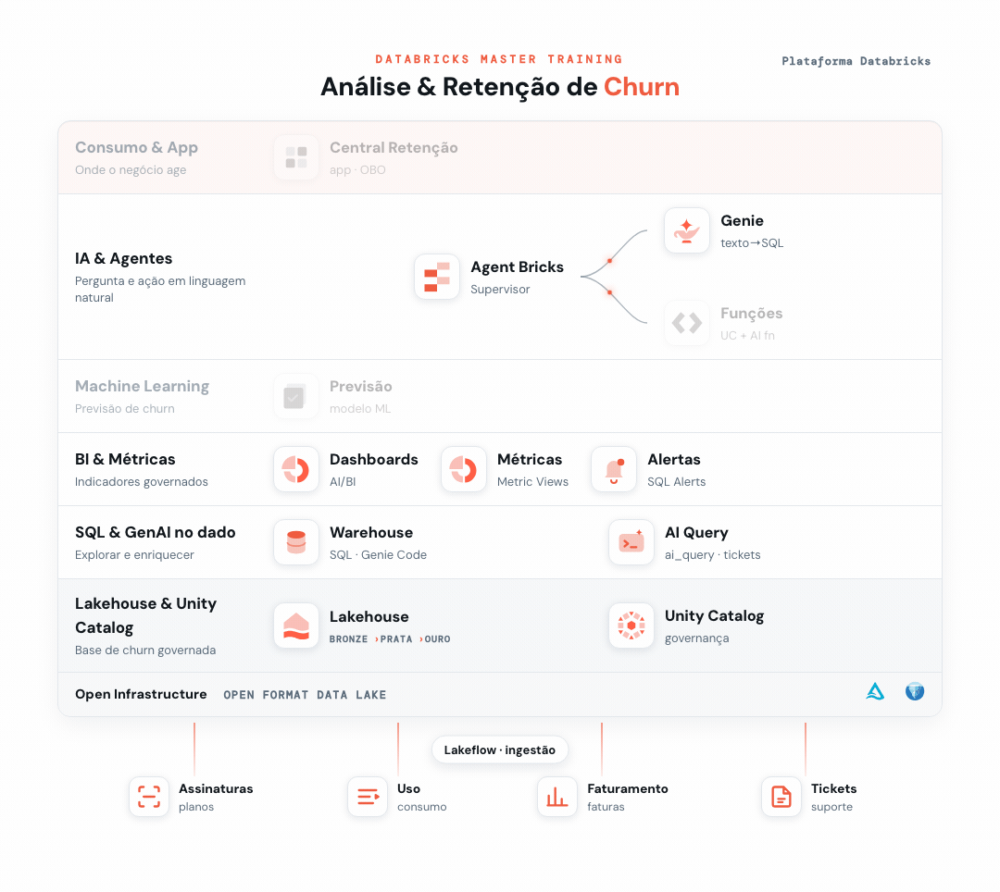

# 06 - Análise de Dados com Solução Multi-Agent



> _Em destaque, o que você já construiu na trilha até este ponto; em cinza, o que ainda vem._

Até aqui **você** montou as análises. Agora abrimos isso para o time de negócio: **Genie Spaces** onde qualquer pessoa **pergunta em português** — *"qual a receita por segmento?"* — e o Genie escreve o SQL, executa e responde. Zero código.

E vamos além: criamos **dois Genies especializados** — **Faturamento** e **Suporte** — e, no final, um **agente Supervisor** que orquestra os dois. O usuário faz **uma pergunta só**, e o Supervisor descobre sozinho qual especialista deve responder. Isso é uma **solução multi-agent**.

**Pré-requisito:** [Setup](../00%20-%20Setup) concluído (base `dbacademy.churn`).

---

# Parte 1 — Genie de Faturamento

## Passo 1 — Criar o Space
1. No menu lateral, **Genie → New** (ou **New → Genie space**).
2. Em **Data**, adicione:
   - `dbacademy.churn.dim_cliente`
   - `dbacademy.churn.dim_plano`
   - `dbacademy.churn.fato_assinatura`
   - `dbacademy.churn.fato_faturamento`
3. Dê o nome **`Faturamento - <seu_db>`** (troque `<seu_db>`) — vamos reutilizá-lo na Parte 3, no Supervisor.

> O Genie **infere os relacionamentos** entre as tabelas — não precisa configurar joins na mão.

## Passo 2 — Perguntar
Faça as perguntas abaixo (uma por vez). Você **não diz de qual tabela** — o Genie descobre, e ainda mostra o SQL e um gráfico.

```text
Qual a receita total por segmento?
```
Esperado: Consumidor **R$ 3,62 mi** · PME **R$ 1,80 mi** · Corporativo **R$ 680 mil**.

```text
Qual o percentual de faturas não pagas por plano?
```
Esperado: Básico **7,90%** · Padrão **6,49%** · Premium **5,90%** · Empresarial **5,45%** — a inadimplência acompanha o churn: pior no Básico.

---

# Parte 2 — Genie de Suporte

## Passo 3 — Criar o Space
1. **Genie → New** de novo.
2. Em **Data**, adicione:
   - `dbacademy.churn.dim_cliente`
   - `dbacademy.churn.fato_ticket_suporte`
3. Dê o nome **`Suporte - <seu_db>`**.

## Passo 4 — Perguntar
```text
Qual o CSAT médio por categoria de ticket?
```
Esperado: Dúvida **4,08** · Cobrança **2,99** · Técnico **2,28** · Cancelamento **2,27**.

```text
Quantos tickets de suporte temos por canal?
```
Esperado: Chat **447** · Email **407** · Telefone **399**.

## Passo 5 — Faça a seguinte pergunta
```text
Qual a média de NPS do ano fiscal de 2024 no estado do Amazonas (AM)?
```
O Genie responde **≈ 7,3** — mas leia a explicação dele: *"não há definição de ano fiscal, então interpretei como o ano-calendário (jan–dez de 2024)"*. Ele **chutou** que ano fiscal = ano civil. Ninguém disse a ele quando começa o seu ano fiscal.

## Passo 6 — Ensine a regra e pergunte de novo
Em **Instructions** (Instruções gerais), cole a regra do seu ano fiscal:

```text
O ano fiscal (AF) da empresa vai de 1º de outubro a 30 de setembro do ano seguinte, identificado pelo ano em que começa. Exemplo: o AF2024 vai de 01/10/2024 a 30/09/2025. Sempre que a pergunta mencionar "ano fiscal", use esse período (com base em data_abertura), nunca o ano-calendário.
```

Faça **exatamente a mesma pergunta** de novo:

```text
Qual a média de NPS do ano fiscal de 2024 no estado do Amazonas (AM)?
```
Agora o Genie filtra **01/10/2024 a 30/09/2025** e responde **≈ 6,5** — número diferente, porque o período mudou. A mesma pergunta, duas respostas: a diferença foi **a regra que você deu**.

> É a mesma ideia da métrica governada do Ex. 3: **sem a regra explícita, a IA chuta**. As *Instructions* são onde você transforma o conhecimento do negócio em respostas confiáveis — e valem para todo mundo que usa o Space.

---

# Parte 3 — Supervisor (multi-agent)

Você tem dois especialistas. Agora crie o **Supervisor** que recebe a pergunta do usuário e a encaminha para o Genie certo — sem o usuário precisar saber qual é qual.

## Passo 7 — Criar o Supervisor e anexar os agentes
1. No menu lateral, abra **Agents** e crie um novo **Multi-Agent Supervisor**.
2. Vá em **Tools and sub-agents** e selecione a opção **Genie Agents**. No campo de busca, digite o nome do seu agente de faturamento (**`Faturamento - <seu_db>`**) e selecione-o. Na descrição da ferramenta, use:
   ```text
   Especialista em faturamento e cobrança. Responde sobre receita, inadimplência, faturas pagas e não pagas, e valores por plano e por segmento.
   ```
3. Faça o mesmo para o agente de suporte (**`Suporte - <seu_db>`**). Descrição:
   ```text
   Especialista em atendimento e satisfação do cliente. Responde sobre tickets de suporte, CSAT, NPS, canais e categorias — inclusive por ano fiscal.
   ```
4. Remova a ferramenta que já vem por padrão, chamada **`python_exec`**: passe o mouse sobre ela, clique no ícone de **lixeira** e confirme a exclusão. (Neste exercício o Supervisor só coordena os dois Genies.)

## Passo 8 — Nomear, instruir e descrever
> O **nome** só fica editável **depois** que você anexa pelo menos um agente (Passo 7) — por isso deixamos para agora.

1. Dê um **nome** ao Supervisor, por exemplo **`Análise de Clientes - <seu_db>`**.
2. Em **Instructions**, cole as regras de coordenação:
   ```text
   Você coordena dois especialistas: um de Faturamento (receita, inadimplência, faturas, planos) e um de Suporte (tickets, CSAT, NPS, canais). Encaminhe cada pergunta ao especialista adequado, combine as respostas quando a pergunta envolver os dois temas e responda sempre em português.
   ```
3. Mais abaixo, em **Description**, coloque:
   ```text
   Assistente de análise de clientes: responde perguntas de negócio sobre faturamento e sobre atendimento/suporte, encaminhando cada pergunta ao especialista certo.
   ```

## Passo 9 — Testar o roteamento
Faça estas **duas perguntas novas** (uma de cada domínio) e observe o Supervisor **escolher o especialista certo** antes de responder:

```text
Qual o valor total em faturas não pagas?
```
Esperado: o Supervisor aciona o **agente de Faturamento** → **≈ R$ 383.335** (3.846 faturas em aberto).

```text
Qual a nota média de NPS por canal de atendimento?
```
Esperado: o Supervisor aciona o **agente de Suporte** → Chat **6,57** · Email **6,54** · Telefone **6,47**.

> Repare que você não disse a qual Genie perguntar — o Supervisor **leu a pergunta, escolheu o especialista e sintetizou a resposta**. É assim que uma solução multi-agent esconde a complexidade do usuário de negócio: uma porta de entrada, vários especialistas atrás.
