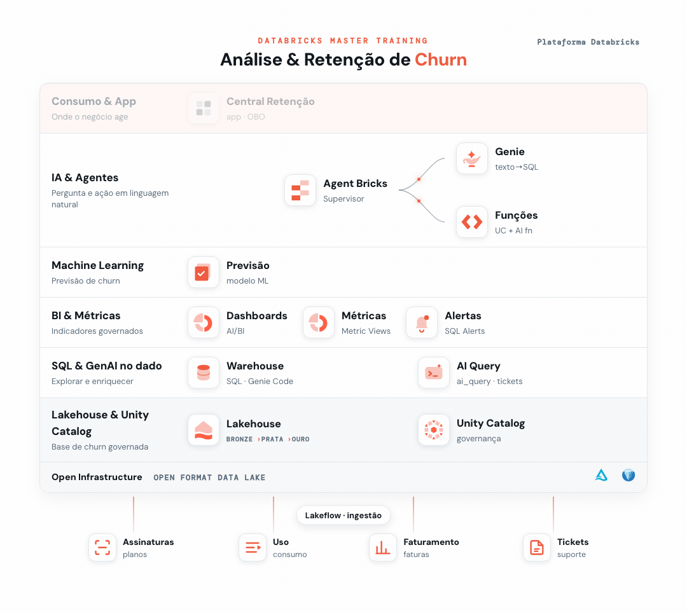

# 08 - Retenção com ML e GenAI



> _Em destaque, o que você já construiu na trilha até este ponto; em cinza, o que ainda vem._

Até aqui você **detectou** quem está em risco (dashboards + modelo do Ex. 6) e **diagnosticou** o porquê (IA + agentes). Agora vamos **agir**: criar as funções que, a partir de um `id_cliente`, montam a oferta de retenção certa e geram um e-mail marketing personalizado. E vamos criá-las conversando com o **Genie Code**, sem escrever SQL na mão.

O pulo do gato deste módulo: as regras de negócio ficam **governadas no Unity Catalog** (reutilizáveis pelo app do Ex. 9, pelo Genie e por qualquer agente) e a **IA só escreve o texto**, sem decidir a oferta.

**Pré-requisitos:**
- [Setup](../00%20-%20Setup) concluído (base `dbacademy.churn`).
- Seu database pessoal criado (Passo 0 do [Ex. 1](../01%20-%20SQL%20com%20IA)).
- [Ex. 6 - Previsão de Churn (ML)](../06%20-%20Previs%C3%A3o%20de%20Churn%20%28ML%29) concluído: precisamos da tabela `churn_scores` no seu schema.

## Objetivo
Criar duas UC Functions no seu schema `dbacademy.<seu_db>`, uma de cada vez, usando o **Genie Code** (o assistente ✨ do SQL Editor):
- **`get_cliente_360(id)`**: passa o id do cliente, recebe o perfil dele (cadastro + risco);
- **`gerar_email_retencao(id)`**: passa o id, recebe o e-mail de retenção pronto, com a oferta certa aplicada.

> **Por que funções, e não SQL solto no app?** Uma função vira um ativo governado do Unity Catalog: o app fica fino (só chama a função), o acesso é controlado (EXECUTE) e a mesma lógica é reutilizada por outras ferramentas. É a diferença entre "cada um faz do seu jeito" e "uma regra única, governada".

---

## Passo 0: Seu database
As funções são criadas no seu schema `dbacademy.<seu_db>`. Use o mesmo database dos Ex. 1 e Ex. 6. Nos prompts abaixo, troque `<seu_db>` pelo seu database.

## Passo 1: Criar a `get_cliente_360` (do id ao perfil)
Abra o **SQL Editor**, ative o **Genie Code** (✨) e cole o prompt abaixo (troque `<seu_db>`). Revise o `CREATE FUNCTION` que ele gerar e clique em **Run**:

```text
Crie uma UC Function (função SQL de tabela) chamada get_cliente_360(p_id STRING) no schema dbacademy.<seu_db>. Ela junta as tabelas dbacademy.churn.dim_cliente e dbacademy.<seu_db>.churn_scores por id_cliente e retorna o perfil do cliente cujo id_cliente = p_id: nome_cliente, cidade, uf, segmento, canal_aquisicao, data_cadastro (de dim_cliente) e nome_plano, preco_mensal, prob_churn, faixa_risco, fator_principal (de churn_scores).
```

<details>
<summary>👉 Resultado:</summary>

> Troque `<seu_db>` pelo seu database antes de rodar.

```sql
CREATE OR REPLACE FUNCTION dbacademy.<seu_db>.get_cliente_360(p_id STRING)
RETURNS TABLE (nome_cliente STRING, cidade STRING, uf STRING, segmento STRING,
  canal_aquisicao STRING, data_cadastro DATE, nome_plano STRING, preco_mensal DOUBLE,
  prob_churn DOUBLE, faixa_risco STRING, fator_principal STRING)
RETURN
  SELECT c.nome_cliente, c.cidade, c.uf, c.segmento, c.canal_aquisicao, c.data_cadastro,
         s.nome_plano, s.preco_mensal, s.prob_churn, s.faixa_risco, s.fator_principal
  FROM dbacademy.churn.dim_cliente c
  JOIN dbacademy.<seu_db>.churn_scores s ON c.id_cliente = s.id_cliente
  WHERE c.id_cliente = p_id;
```

</details>

Teste:
```sql
SELECT * FROM dbacademy.<seu_db>.get_cliente_360('C01575');
```
Resultado (a cliente Marina Ribeiro):

| nome | cidade/uf | cliente desde | plano | risco | fator principal |
|------|-----------|---------------|-------|-------|-----------------|
| Marina Ribeiro | Fortaleza/CE | 2021 | Básico (R$ 49,90) | **Alto** | Insatisfação (CSAT) |

> Um único ponto de entrada para "tudo sobre o cliente", juntando o cadastro (`dim_cliente`) com o seu score do Ex. 6 (`churn_scores`).

## Passo 2: As regras de retenção
A próxima função monta a oferta a partir de três regras de negócio. Elas usam só dados que já temos, inclusive o `fator_principal` que o modelo do Ex. 6 calculou:

| Regra | Condição | Oferta |
|-------|----------|--------|
| **Tempo de casa** | 5 anos ou mais | desconto de **15%** na fatura |
| | menos de 5 anos | desconto de **10%** |
| **Plano** | Básico | **10GB** de internet grátis |
| | acima do Básico | **dobro** da internet + WhatsApp ilimitado |
| **Motivo do risco** | Insatisfação (CSAT) | gerente de conta dedicado |
| | Inadimplência | renegociação da fatura sem juros |
| | Baixo uso | sessão gratuita de treinamento |
| | Detrator (NPS) | ligação com um especialista |

## Passo 3: Criar a `gerar_email_retencao` (do perfil ao e-mail)
De volta ao **Genie Code** (✨), cole o prompt abaixo (troque `<seu_db>`). Ele calcula as regras acima em SQL (`CASE`) e usa `ai_query` para redigir o e-mail. Revise e clique em **Run**:

```text
Crie uma UC Function (função SQL de tabela) chamada gerar_email_retencao(p_id STRING) no schema dbacademy.<seu_db>, usando as tabelas dbacademy.churn.dim_cliente e dbacademy.<seu_db>.churn_scores unidas por id_cliente. Ela retorna uma coluna email com um e-mail de retenção personalizado em português para o cliente cujo id_cliente = p_id. Meça o tempo de casa com datediff entre a data de referência da base DATE '2026-09-23' e data_cadastro (use essa data fixa, não a data atual, para o resultado ficar estável). Calcule em SQL com CASE três ofertas e depois use ai_query('databricks-meta-llama-3-3-70b-instruct', ...) para redigir o e-mail citando nome, cidade e anos de casa, oferecendo exatamente: (a) desconto de 15% se o cliente tem 5 anos ou mais de casa, senão 10%; (b) se nome_plano = 'Básico' então 10GB de internet grátis, senão o dobro da internet + WhatsApp ilimitado; (c) conforme fator_principal: 'Insatisfação (CSAT)' -> gerente de conta dedicado, 'Inadimplência' -> renegociação da fatura sem juros, 'Baixo uso' -> sessão gratuita de treinamento, caso contrário -> ligação com um especialista.
```

<details>
<summary>👉 Resultado:</summary>

> Troque `<seu_db>` pelo seu database antes de rodar.

```sql
CREATE OR REPLACE FUNCTION dbacademy.<seu_db>.gerar_email_retencao(p_id STRING)
RETURNS TABLE (email STRING)
RETURN
  WITH dados AS (
    SELECT dc.nome_cliente, dc.cidade,
      -- data de referência da base (a base é um retrato de 23/09/2026); medir o tempo de casa
      -- contra ela, e não contra a data atual, mantém o resultado estável ao longo do tempo.
      FLOOR(DATEDIFF(DATE '2026-09-23', dc.data_cadastro) / 365) AS anos_de_casa,
      cs.nome_plano, cs.fator_principal,
      CASE WHEN DATEDIFF(DATE '2026-09-23', dc.data_cadastro) >= 5 * 365 THEN '15%' ELSE '10%' END AS desconto,
      CASE WHEN cs.nome_plano = 'Básico' THEN '10 GB de internet grátis'
           ELSE 'o dobro da sua internet atual + WhatsApp ilimitado' END AS oferta_internet,
      CASE WHEN cs.fator_principal = 'Insatisfação (CSAT)' THEN 'um gerente de conta dedicado'
           WHEN cs.fator_principal = 'Inadimplência' THEN 'renegociação da sua fatura sem juros'
           WHEN cs.fator_principal = 'Baixo uso' THEN 'uma sessão gratuita de treinamento'
           ELSE 'uma ligação com um especialista' END AS oferta_fator
    FROM dbacademy.churn.dim_cliente dc
    JOIN dbacademy.<seu_db>.churn_scores cs ON dc.id_cliente = cs.id_cliente
    WHERE dc.id_cliente = p_id
  )
  SELECT ai_query(
    'databricks-meta-llama-3-3-70b-instruct',
    'Você é um especialista em retenção de clientes. Redija um e-mail profissional e empático em português para convencer o cliente a permanecer. ' ||
    'Dados: Nome: ' || nome_cliente || ', Cidade: ' || cidade || ', Anos de casa: ' || CAST(anos_de_casa AS STRING) ||
    '. Ofertas: (a) desconto de ' || desconto || ' na mensalidade; (b) ' || oferta_internet || '; (c) ' || oferta_fator ||
    '. Cite o nome, a cidade e os anos de casa e mencione as três ofertas de forma natural.'
  ) AS email
  FROM dados;
```

</details>

> **Repare no que o Genie faz sozinho:** ele consulta as tabelas, descobre os valores de `fator_principal` e `nome_plano`, monta os `CASE` certos e o `ai_query`. Você só descreveu as regras. Se ele assumir um setor específico (ex.: "telecom"), acrescente ao prompt *"empresa de assinatura genérica, não cite o setor"*.

> **Por que uma data fixa (`DATE '2026-09-23'`) e não `CURRENT_DATE()`?** A base é um retrato (dados estáticos). Medir o "tempo de casa" contra a data de hoje faria o resultado mudar sozinho conforme os dias passam (um cliente na véspera dos 5 anos viraria 15% no dia seguinte). Usando a data de referência da base, o resultado é o mesmo para toda a turma, em qualquer dia.

Teste com a Marina (5 anos · Básico · Insatisfação):
```sql
SELECT email FROM dbacademy.<seu_db>.gerar_email_retencao('C01575');
```
> *"Olá Marina Ribeiro… é um prazer ter você conosco **há 5 anos**… em **Fortaleza**… um **desconto de 15%** na sua fatura… **10GB de internet grátis**… **gerente de conta dedicado**…"*

## Passo 4: Conferir as regras
Teste um cliente do outro lado das regras:
```sql
SELECT email FROM dbacademy.<seu_db>.gerar_email_retencao('C00018');
```
É a Gabriela Cardoso (4 anos · Empresarial · Inadimplência), e o e-mail muda sozinho:

| Cliente | Tempo | Plano | Motivo | E-mail oferece |
|---------|-------|-------|--------|----------------|
| Marina (C01575) | 5 anos | Básico | Insatisfação | 15% · 10GB grátis · gerente dedicado |
| Gabriela (C00018) | 4 anos | Empresarial | Inadimplência | **10%** · **dobro + WhatsApp** · **renegociação sem juros** |

Leia os dois e-mails lado a lado: a mesma função, ofertas diferentes, cada uma correta para o cliente.

> **A lição:** a **regra de negócio é governada** (SQL, verificável, igual para todos), a **IA cuida só da linguagem**. Você nunca fica refém de a IA "inventar" um desconto, e criou tudo isso só descrevendo o que queria ao Genie Code.

## Explore
Você acabou de construir o motor de ação da retenção: dado um cliente em risco, sai a oferta certa e o e-mail pronto, com a regra de negócio governada e a IA só na escrita. No próximo módulo (Ex. 9 - Criação de Apps), o app **Central de Retenção** vai chamar exatamente essas duas funções: o atendente digita o id, vê o perfil e o risco, e clica para gerar o e-mail.
