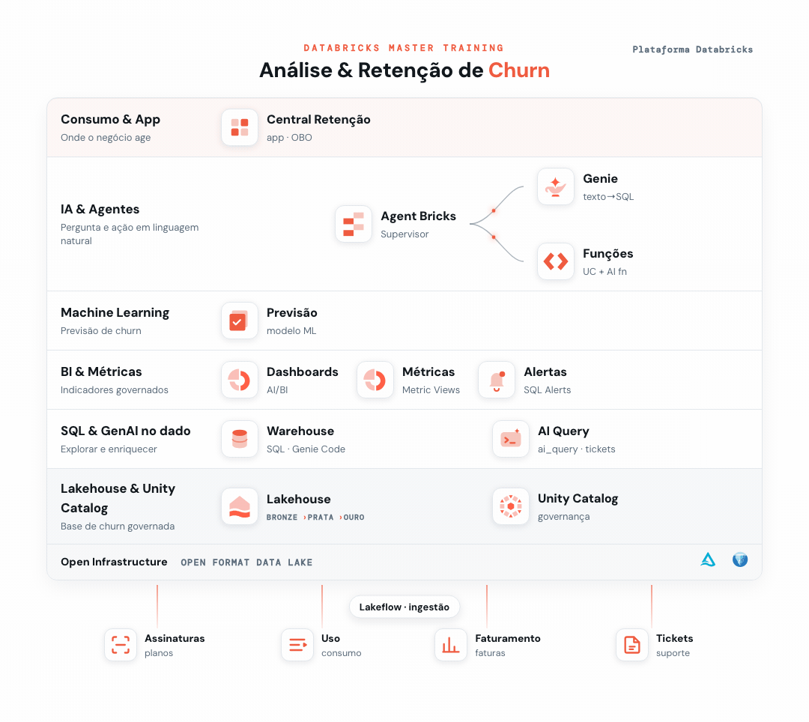
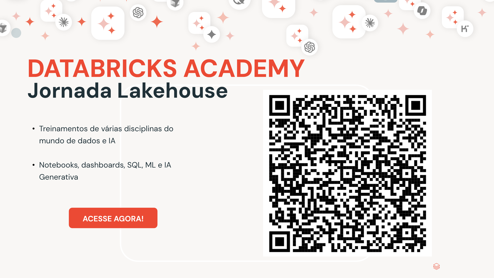

# 10 - Fechamento (Próximos Passos)

> _A plataforma completa que você construiu ao longo da trilha, do dado cru ao app de retenção._

## 🎉 Parabéns!

Você chegou ao fim do **Master Training**. Partindo de uma única pergunta de negócio (*por que os clientes cancelam e como retê-los?*), você percorreu a plataforma Databricks de ponta a ponta, em modo **low-code**, e entregou um produto de retenção completo.

## O desafio de churn, resolvido

Você fechou o ciclo **Detectar → Diagnosticar → Decidir → Agir**, sempre sobre a mesma base:

- **🔍 Detectar** quem está prestes a cancelar: alertas, métricas governadas, dashboards e um modelo de ML que dá um score de risco a cada cliente.
- **🩺 Diagnosticar** o porquê: IA Generativa lendo a "voz do cliente" nos tickets e agentes conversacionais que respondem em português.
- **🎯 Decidir** a oferta certa: funções governadas que transformam o score em uma ação, com as regras de negócio em SQL e a IA só na escrita.
- **✅ Agir**: a Central de Retenção, o app que reúne tudo e o time de negócio usa no dia a dia.

## O que você construiu

| Módulo | Entrega |
|--------|---------|
| **00 · Setup** | Base de churn governada no Unity Catalog (dados + documentação). |
| **01 · SQL com IA** | Explorar a base no SQL Editor com o Genie Code (✨). |
| **02 · Geração de Alertas** | Alertas que disparam quando um indicador de churn cruza um limite. |
| **03 · Métricas de Negócio** | Métricas governadas (churn, receita, suporte) reutilizáveis. |
| **04 · IA Generativa no SQL** | `ai_query` sobre os tickets: sentimento, categoria, PII e resumo. |
| **05 · Dashboards com IA** | Painel executivo de churn no AI/BI, montado a partir de prompts. |
| **06 · Previsão de Churn (ML)** | Modelo de probabilidade de churn + a tabela `churn_scores`. |
| **07 · Análise de Dados Multi-Agent** | Dois Genies (Faturamento e Suporte) + um Supervisor que orquestra. |
| **08 · Retenção com ML e GenAI** | UC Functions: o perfil 360 do cliente e o e-mail de retenção personalizado. |
| **09 · Criação de Apps** | A **Central de Retenção**: Cockpit + Assistente + Retenção, num único deploy. |

É o mesmo padrão que você leva para qualquer caso de uso e indústria: **dados → métricas → IA → agentes → app**, tudo governado pelo Unity Catalog.

## Continue a jornada 🚀

O churn foi só o começo. Para se aprofundar em cada disciplina (SQL, dashboards, Machine Learning e IA Generativa), continue na **Databricks Academy · Jornada Lakehouse**:

- Treinamentos de várias disciplinas do mundo de dados e IA.
- Trilhas práticas de Notebooks, dashboards, SQL, ML e IA Generativa.

> 📱 Aponte a câmera do celular para o QR code acima e acesse a trilha.

---

Obrigado por participar, e bons projetos! 👏
