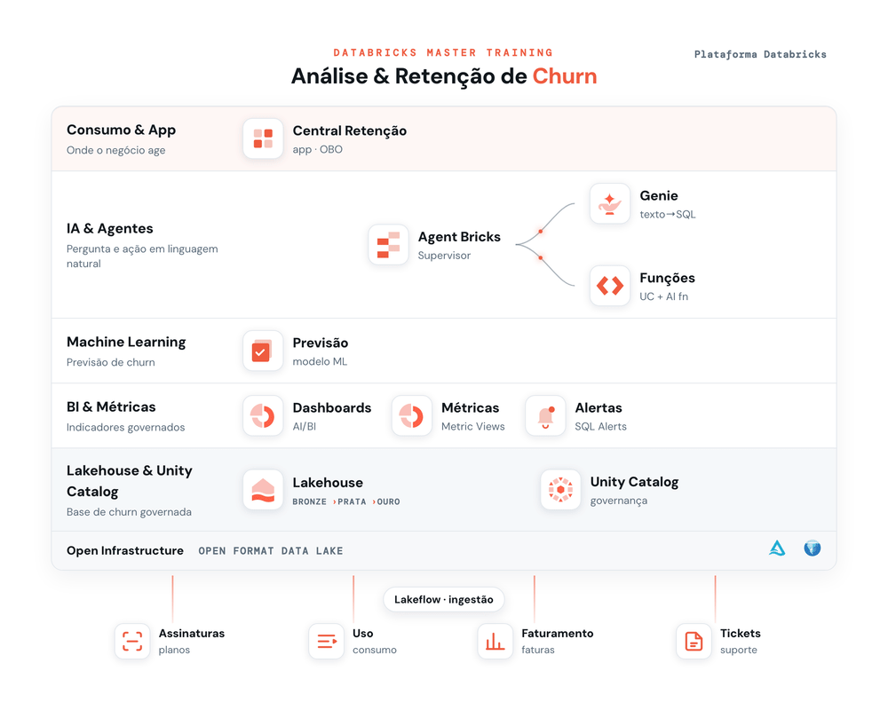

# Databricks Master Training — Análise de Clientes & Churn

Treinamento hands-on na plataforma Databricks que leva o participante **do SQL self-service aos agentes de IA**, sempre sobre um mesmo desafio de negócio: **entender e reduzir o churn** (cancelamento) de clientes.

## Objetivo

Capacitar times de **negócio e dados** a usar a plataforma Databricks de ponta a ponta — em modo **low-code** — para responder a uma pergunta real: *por que os clientes cancelam e como retê-los?*

Ao longo da trilha, o participante:
- consulta e modela dados de churn (SQL, Metric Views);
- aplica **IA Generativa** sobre texto (tickets de suporte);
- cria dashboards e **agentes conversacionais (Genie)**;
- treina um **modelo de churn** e o serve com governança;
- orquestra tudo em um **agente supervisor** e entrega um **app** de retenção.

O domínio é uma **empresa de assinatura genérica**, então a trilha se adapta a qualquer cliente/indústria. Todo o conteúdo é **reproduzível em qualquer workspace** — os dados vêm de CSVs versionados neste repositório.

## Arquitetura de dados

- **Base compartilhada** (schema `churn`, somente leitura): criada uma vez no Setup e usada por toda a turma.
- **Schema pessoal por participante** (`<catálogo>.<seu_database>`): recebe o que cada um cria nos exercícios (metric views, modelo, funções, etc.).
- Objetos de workspace (Genie, Supervisor, App) são criados por participante.

## Trilha

| Módulo | Conteúdo |
|--------|----------|
| **00 - Setup** | Preparação da base compartilhada de churn (dados + documentação + base de conhecimento). Começe por aqui. |
| **01 - SQL com IA** | Explorar a base no SQL Editor e gerar SQL com o assistente (Genie Code). |
| **02 - Geração de Alertas** | Criar alertas que disparam quando um indicador de churn cruza um limite. |
| **03 - Métricas de Negócio** | Definir métricas governadas (churn, receita, suporte) e consultá-las com MEASURE(). |
| **04 - IA Generativa no SQL** | IA Generativa no SQL sobre os tickets: sentimento, classificação, PII e resumo. |
| **05 - Dashboards com IA** | Painel executivo de churn no AI/BI, com os gráficos montados pelo Assistente (✨) a partir de prompts. |
| **06 - Previsão de Churn (ML)** | Treinar e registrar um modelo de probabilidade de churn e gerar a tabela de scores que alimenta os agentes e o app. |
| **07 - Análise de Dados Multi-Agent** | Criar dois Genies (Faturamento e Suporte) e um agente Supervisor que orquestra os dois, roteando cada pergunta ao especialista certo. |
| **08 - Retenção com ML e GenAI** | Criar funções governadas (UC Functions) que transformam o score em ação: o perfil 360 do cliente e um e-mail de retenção personalizado — com as regras de oferta em SQL e a IA só na escrita. |
| **09 - Criação de Apps** | Publicar a **Central de Retenção**: o app que amarra o treinamento inteiro — Cockpit de churn (mapa + gráficos com leitura por IA), Assistente (o Supervisor do Ex. 7) e Retenção personalizada (as funções do Ex. 8) — com um único notebook de deploy. |

## Como começar

Abra a pasta **[`00 - Setup`](./00%20-%20Setup)** e siga o `README.md` de lá.
